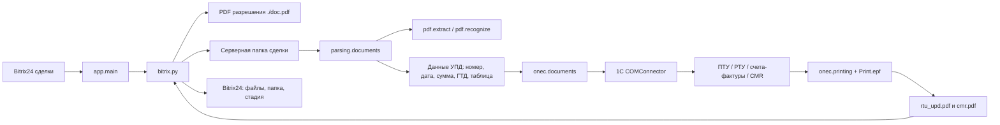

# AutoDoc Accounting

AutoDoc Accounting автоматизирует бухгалтерскую цепочку для сделок Bitrix24:

1. находит сделки на нужной стадии в Bitrix24;
2. забирает данные сделки, папку с документами и разрешительный PDF при необходимости;
3. ищет и разбирает УПД в серверной папке;
4. создает и проводит документы в 1C через COMConnector;
5. печатает CMR/УПД во внешнюю обработку `Print.epf`;
6. загружает готовые PDF обратно в Bitrix24 и переводит сделку на финальную стадию.

Подробный справочник по модулям, функциям и сущностям лежит в [docs/reference.md](docs/reference.md).

## Архитектура



### Слои проекта

| Слой | Файлы | Ответственность |
| --- | --- | --- |
| Оркестрация | `app.py`, `__main__.py`, `__init__.py` | Главный сценарий обработки сделок. |
| Bitrix24 | `bitrix.py`, `settings.py` | REST-запросы к Bitrix24, статусы, файлы, уведомления. |
| Парсинг документов | `parsing/documents.py`, `parsing/utils.py` | Извлечение данных из разрешений и УПД. |
| Низкоуровневый PDF | `pdf/extract.py`, `pdf/recognize.py`, `pdf/fields.py` | Извлечение текста, координат и таблиц из PDF. |
| 1C | `onec/documents.py`, `onec/printing.py` | Создание, корректировка, проведение и печать документов 1C. |

## Основной сценарий

Точка входа - `app.main()`.

1. `findDeal()` получает сделки Bitrix24 на стадии `C17:UC_NZTLLE`.
2. Для каждой сделки берется `dealID`.
3. `getFile()` проверяет, есть ли в товарах признак `МИИР РК`.
   Если признак есть, скачивается разрешительный PDF в `./doc.pdf`.
4. `getCMRInfo()` возвращает серверную папку, перевозчика, города, дату РТУ, номер авто и признак частичной отгрузки.
5. Частичные отгрузки пропускаются и переводятся на стадию ручной обработки.
6. Создается подключение к 1C через `win32com.client.Dispatch("V83.COMConnector")`.
7. `extractBitrixDocInfo()` разбирает разрешительный PDF, если он есть.
8. `extractServerDocInfo()` ищет УПД в серверной папке и возвращает:
   `updNum`, `updDate`, `updSumItems`, `updSumNDS`, `updSum`, `gtdArr`, `dfUpd`.
9. Сделка временно переводится в стадию `C17:UC_BBPEXS`.
10. `operations1C()` выполняет основную работу в 1C.
11. Если документы созданы, `updateFolderBTX()` записывает путь клиентской папки в Bitrix24.
12. `addToBTX()` загружает `rtu_upd.pdf` и `cmr.pdf` в сделку.
13. Сделка переводится в стадию `C17:UC_DHCK5O`.

## Зависимости

### Среда выполнения

Проект рассчитан на Windows-среду, потому что использует COM-подключение к 1C:

- установленная платформа 1C с `V83.COMConnector`;
- Python с пакетом `pywin32`;
- доступ к базе 1C, указанной в строке подключения;
- доступ к Bitrix24 REST API;
- доступ к сетевой папке `SERVER_PATH`;
- внешний файл обработки `Print.epf` рядом с рабочим каталогом процесса;
- системные зависимости для Camelot, обычно Ghostscript и компоненты для табличного извлечения PDF.

### Python-пакеты

Минимальный набор зависимостей по импортам проекта:

```bash
pip install requests pywin32 pandas numpy camelot-py[cv] pdfplumber PyPDF2 pdfminer.six thefuzz pytz openpyxl
```

`openpyxl` нужен из-за диагностических выгрузок `DataFrame.to_excel(...)`.
Для ускорения fuzzy-сравнений можно дополнительно поставить `python-Levenshtein`.

## Конфигурация

Сейчас часть параметров зашита в код:

- базовый webhook Bitrix24 и серверный путь - `settings.py`;
- отдельные Bitrix24 REST URL для бота и поиска сделок - `bitrix.py`;
- строка подключения к 1C - `app.py`;
- пути клиентских папок - `onec/documents.py`;
- имя внешней обработки - `onec/printing.py`.

Для промышленного запуска лучше вынести эти значения в переменные окружения или отдельный локальный конфиг, который не хранится в репозитории.

## Запуск

Запускать пакет нужно из директории, которая содержит папку `autodoc_accounting`:

```bash
cd /path/to/project_now
python -m autodoc_accounting
```

При запуске из самой папки пакета относительные импорты вида `from .bitrix import ...` могут не сработать.

## Входные и выходные данные

### Вход

- сделки Bitrix24 на стадии `C17:UC_NZTLLE`;
- поля сделки Bitrix24 с серверной папкой, перевозчиком, городами, датой и файлами;
- PDF-разрешение из Bitrix24, если по товарам требуется проверка МИИР РК;
- УПД в серверной папке сделки;
- документы 1C, связанные с номером сделки.

### Выход

- документы 1C: заказ поставщику при необходимости, приобретение товаров и услуг, реализация товаров и услуг, счета-фактуры, CMR;
- печатные формы `rtu_upd.pdf` и `cmr.pdf`;
- путь клиентской папки в поле сделки Bitrix24;
- файлы, приложенные к сделке Bitrix24;
- перевод сделки на финальную или ручную стадию.

## Ключевые сущности

| Сущность | Где используется | Что означает |
| --- | --- | --- |
| Сделка Bitrix24 | `app.py`, `bitrix.py` | Единица обработки. Ее `ID` используется как номер сделки и ключ поиска в 1C. |
| Разрешительный PDF | `bitrix.getFile()`, `parsing.extractBitrixDocInfo()` | Документ для проверки МИИР РК и кодов ТН ВЭД. Сохраняется как `./doc.pdf`. |
| УПД | `parsing.extractServerDocInfo()` | Основной бухгалтерский документ поставщика. Из него берутся номер, дата, суммы, ГТД и табличная часть. |
| `gtdArr` | `parsing.documents`, `onec.documents` | Массив строк ГТД: номер строки, страна, регистрационный номер ГТД, наименование, количество. |
| `dfUpd` | `parsing.documents`, `onec.documents` | Таблица УПД в виде `pandas.DataFrame`; используется для сверки и корректировки заказов поставщику. |
| Заказ клиента 1C | `operations1C()` | Ищется по номеру сделки. Определяет перепродажу и основание для дальнейших документов. |
| Заказ поставщику 1C | `operations1C()`, `correctord()` | Ищется или создается по `ИДСделкиБитрикс24`; корректируется по УПД. |
| ПТУ | `operations1C()`, `createPTU()` | Приобретение товаров и услуг. Создается по заказу поставщику или для цепочки перепродажи. |
| РТУ | `operations1C()`, `createRTU()` | Реализация товаров и услуг. Создается для клиента или для перепродажи. |
| CMR | `operations1C()` | Транспортный документ, заполняется на основании РТУ. |
| `Print.epf` | `onec.printing.print_docs()` | Внешняя обработка 1C, которая печатает CMR и УПД в PDF. |

## Важные нюансы

- В проекте много `bare except`, поэтому ошибка часто превращается в пропуск сделки и уведомление в Bitrix24/чат.
- Парсинг PDF чувствителен к шаблону документа, координатам и качеству PDF. Сканированные или нестандартные УПД обычно уходят в ручную обработку.
- Функции парсинга пишут временные файлы в текущий каталог: `doc.pdf`, `rotated.pdf`, `test.xlsx`, `test2.xlsx`, `testik.xlsx`.
- `parsing.documents.dealID` - модульная глобальная переменная для сообщений об ошибках. `app.main()` обновляет ее перед парсингом УПД.
- В `operations1C()` есть параметр `has_miir_doc`, но текущий вызов из `app.main()` не передает `False` для случая `miir_no_doc`. Если бизнес-правило "МИИР РК без разрешения запрещен при перепродаже" должно работать, вызов нужно синхронизировать с этим параметром.
- В `createPTU()` аргумент называется `RTUdate`, а внутри функции используется имя `RTUDate`. В текущем виде ветка перепродажи может упасть с `NameError`, если это место не было перекрыто внешним окружением.
- В коде есть несколько значимых констант стадий Bitrix24:
  - `C17:UC_NZTLLE` - сделки к обработке;
  - `C17:UC_BBPEXS` - ручная обработка или промежуточная стадия;
  - `C17:UC_DHCK5O` - успешное завершение.
